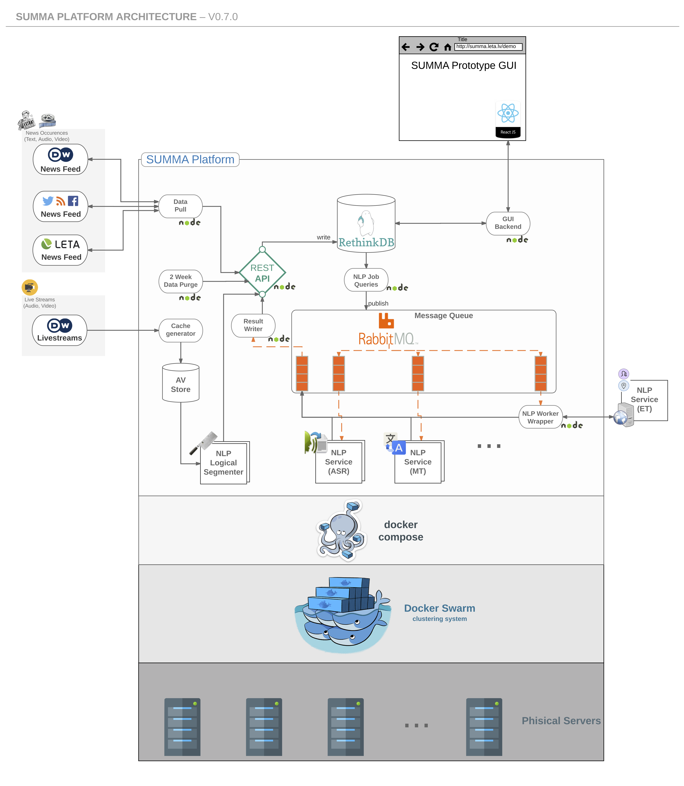
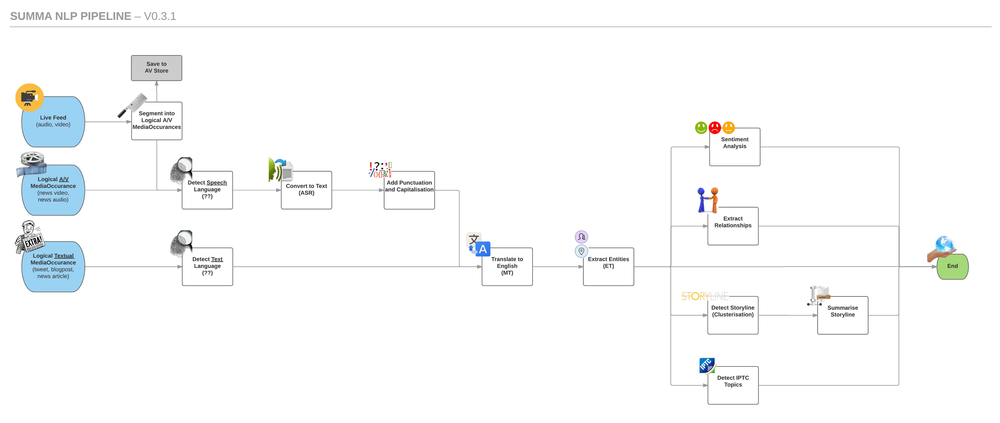

# About

This is a central repository to launch SUMMA Platform. The Open Source NLP Components can be found [github.com/summa-platform](https://github.com/summa-platform).
By default the platform can process English and German content.

[SUMMA Poster](./SUMMAposter.pdf)

This is part of 
[SUMMA Project H2020](http://summa-project.eu)

# Requirements
## Software

   1. __Docker Engine 17.06.0+__

      Install via convenience script

            curl -fsSL get.docker.com | sh

      or see [other install options](https://docs.docker.com/engine/installation/).

     

   2. __Docker Compose 1.6+__

      Install via

            curl -L https://github.com/docker/compose/releases/download/1.16.1/docker-compose-`uname -s`-`uname -m` > /usr/local/bin/docker-compose
            chmod +x /usr/local/bin/docker-compose

      or see [other install options](https://docs.docker.com/compose/install/).

---

# Startup
The summa platform can be run either in development mode an a single machine or in production mode on a cluster of machines. Below are details how to run in each mode.

## On a Single Machine using Docker Compose
1. Pull the prebuild docker images from the SUMMA private registry

       docker-compose pull

2. Start the SUMMA platform

       docker-compose -f docker-compose.yml -f docker-compose.local.yml up

   or

       ./deploy.sh prod local up

3. Open <http://localhost:8000> in your browser
    - the _journalist-gui_ is at `/`
       * _user:_ admin@summa
       * _pass:_ admin

    **Note:** give some time for the system to start-up.

## On a Cluster of Machines using Docker Swarm
1. Create [Docker Swarm](https://docs.docker.com/engine/swarm/swarm-mode/) from one or more hosts

   1. Create manager node

             docker swarm init

      It will output swarm join command for joining workers nodes.

   2. Add one or more worker nodes by executing swarm join command (copied from the previous step) on all worker hosts

             docker swarm join ...

   All steps below must be executed on manager node.

2. Override default configuration if required

   1. Override default environment defined in `.env` by creating `local.env` or `.local.env`

   2. Override `docker-compose.yml` settings by creating `docker-compose.override.yml`

3. Deploy to swarm by executing

        ./deploy.sh prod STACK

   where STACK is some un-used stack name, e.g., `summa-platform`.

   **Note:** by default all images are pre-built and will be pulled from Docker Hub.

4. Optionally see deployment state

   1. Check node status

            docker node ls

   2. Check service status

            docker service ls

6. Open <http://manager-node-hostname-or-ip:8000> (replace with the real hostname or IP address of your manager node) in your browser
    - the _journalist-gui_ is at `/`
       * _user:_ admin@summa
       * _pass:_ admin

    **Note:** give some time for the system to start-up.

## Shutdown

To shutdown the platform, remove the running stack

    ./deploy.sh rm STACK

## Re-deploying

1. Pull latest configuration changes

        git pull

2. Adjust overridden configuration and environment if required

3. Pull updated docker images

        ./deploy.sh prod pull

4. Optionally remove already running stack for clean re-deploy

        ./deploy.sh rm STACK

5. Deploy updated stack

        ./deploy.sh prod STACK

## Building from source

1. Start local registry

        ./deploy.sh registry [DATADIR]

   _DEPRECATED:_ optionally update `PRIVATE_REGISTRY_URL` environment variable to point to local registry by updating/creating `local.env` with line

        PRIVATE_REGISTRY_URL=127.0.0.1:5000

2. Because some images are only available from Docker Hub, a valid login to Docker Hub is required.

3. Build images from source

        ./deploy.sh build

4. Push images to local registry

        ./deploy.sh push

5. Deploy

        ./deploy.sh STACK

**Note:** steps 3-5. could be replaced with a single command (also works for re-deploying)

    ./deploy.sh full STACK

# Caveats

1. The SUMMA demo platform currently runs as root and needs root
privileges in the directory where the summa-platform is
installed. This means if your system uses root squash on NFS-mounted
directories, you cannot run the SUMMA platform in an NFS-mounted directory
but must use a path local to the machine that is running the summa platform.
We are working on changing this.

   **Update:** Starting with docker engine version 1.10, you can run docker in a dedicated name space. See here: https://success.docker.com/KBase/Introduction_to_User_Namespaces_in_Docker_Engine 

# Architecture

# NLP Pipeline

